# CryptoMailClient

Данная программа представляет собой почтовый клиент, в котором, помимо стандартных функций, можно создавать несколько почтовых ящиков и переключаться между ними, шифровать и расшифровывать сообщения, подписывать и проверять электронно-цифровую подпись, хранить сообщения локально на компьютере.

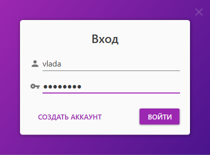
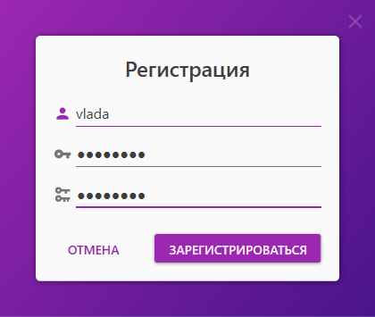

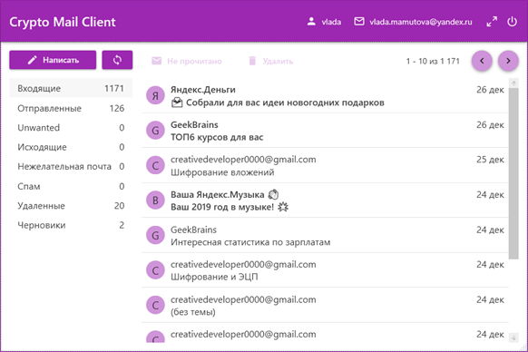
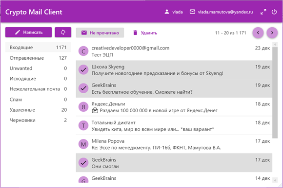

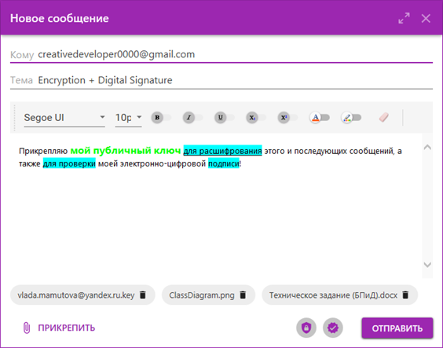
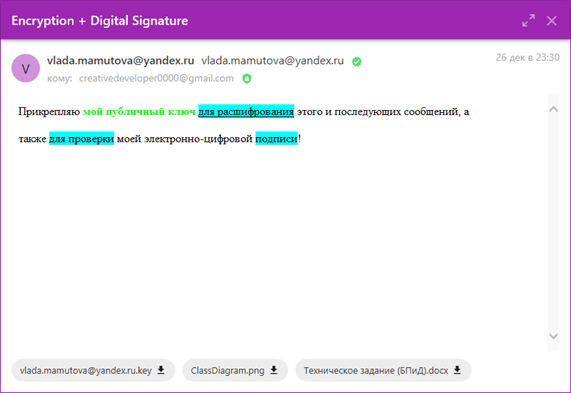

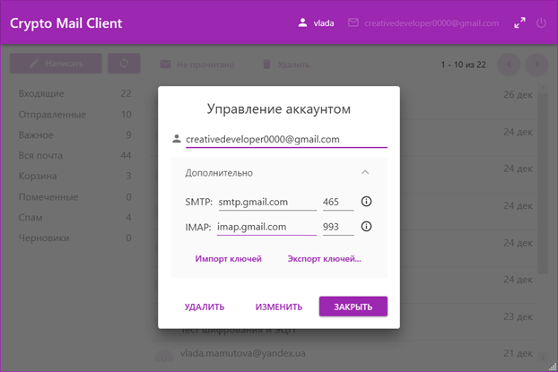
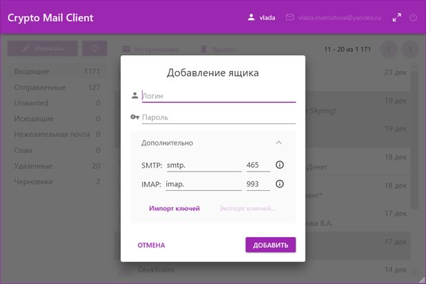

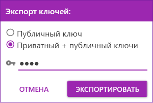
 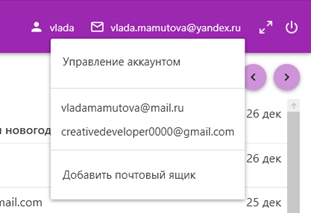

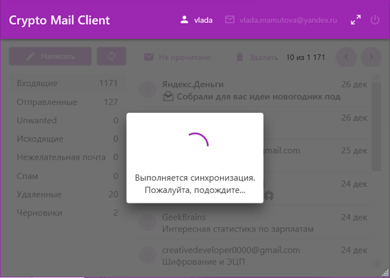

